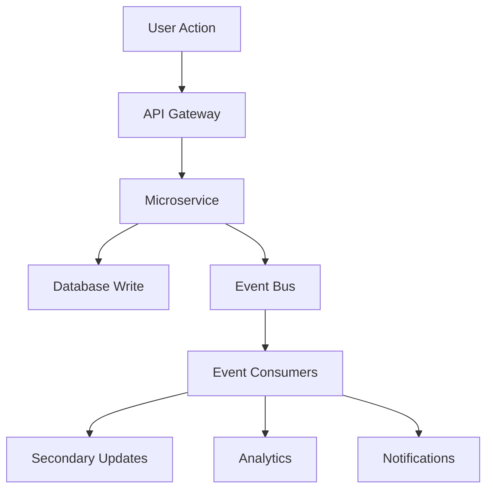

# GetIt Multi-Vendor Ecommerce Platform - Updated Architecture

## 1. High-Level Architecture Overview

### 1.1 Architectural Principles
- **Microservices Architecture**: Domain-driven service boundaries
- **Event-Driven Architecture**: Asynchronous communication between services
- **Cloud-Native Design**: Containerized, scalable, and resilient
- **API-First Approach**: All services expose well-defined APIs
- **Security by Design**: Security integrated at every layer
- **Bangladesh-Focused**: Optimized for local market requirements

### 1.2 Architecture Patterns
- **Domain-Driven Design (DDD)**: Services organized around business domains
- **CQRS**: Command Query Responsibility Segregation for read/write optimization
- **Event Sourcing**: For audit trails and data consistency
- **Saga Pattern**: For distributed transaction management
- **Circuit Breaker**: For fault tolerance and resilience

## 2. System Architecture Layers

### 2.1 Presentation Layer
```
┌─────────────────────────────────────────────────────────────┐
│                    PRESENTATION LAYER                       │
├─────────────────────────────────────────────────────────────┤
│  Web App (React.js)  │  Mobile App (React Native)  │ PWA   │
│  - Customer Portal   │  - Customer App              │       │
│  - Vendor Dashboard  │  - Vendor App                │       │
│  - Admin Panel       │  - Delivery App              │       │
└─────────────────────────────────────────────────────────────┘
```

### 2.2 API Gateway Layer
```
┌─────────────────────────────────────────────────────────────┐
│                      API GATEWAY LAYER                      │
├─────────────────────────────────────────────────────────────┤
│              Kong Gateway / AWS API Gateway                 │
│  • Rate Limiting        • Authentication                    │
│  • Load Balancing       • SSL Termination                  │
│  • Request Routing      • API Versioning                   │
│  • Response Caching     • Request/Response Transformation  │
└─────────────────────────────────────────────────────────────┘
```

### 2.3 Microservices Layer
```
┌─────────────────────────────────────────────────────────────┐
│                    MICROSERVICES LAYER                      │
├─────────────────────────────────────────────────────────────┤
│ Core Services     │ Business Services │ Infrastructure Svcs │
│ • User Service    │ • Order Service   │ • Notification Svc  │
│ • Auth Service    │ • Payment Service │ • Email Service     │
│ • Product Service │ • Shipping Service│ • SMS Service       │
│ • Vendor Service  │ • Analytics Svc   │ • File Service      │
│ • Inventory Svc   │ • Marketing Svc   │ • Search Service    │
└─────────────────────────────────────────────────────────────┘
```

### 2.4 Data Layer
```
┌─────────────────────────────────────────────────────────────┐
│                        DATA LAYER                           │
├─────────────────────────────────────────────────────────────┤
│ PostgreSQL        │ MongoDB           │ Redis              │
│ • User data       │ • Product catalog │ • Session cache    │
│ • Orders          │ • Reviews         │ • Shopping cart    │
│ • Transactions    │ • Logs            │ • Rate limiting    │
│ • Vendor info     │ • Analytics       │ • Temp data        │
├─────────────────────────────────────────────────────────────┤
│                    Elasticsearch                            │
│ • Product search  • Analytics logs  • Business metrics     │
└─────────────────────────────────────────────────────────────┘
```

## 3. Detailed Microservices Architecture

### 3.1 Core Business Services

#### User Management Service
```yaml
Service: user-service
Technology: Node.js + Express.js
Database: PostgreSQL
Responsibilities:
  - User registration and authentication
  - Profile management
  - Role-based access control
  - Account verification
  - Password management
APIs:
  - POST /api/v1/users/register
  - POST /api/v1/users/login
  - GET /api/v1/users/profile
  - PUT /api/v1/users/profile
  - POST /api/v1/users/verify
```

#### Product Catalog Service
```yaml
Service: product-service
Technology: Node.js + Express.js
Database: MongoDB + Elasticsearch
Responsibilities:
  - Product management
  - Category management
  - Inventory tracking
  - Search and filtering
  - Product recommendations
APIs:
  - GET /api/v1/products
  - POST /api/v1/products
  - PUT /api/v1/products/:id
  - DELETE /api/v1/products/:id
  - GET /api/v1/products/search
```

#### Order Management Service
```yaml
Service: order-service
Technology: Node.js + Express.js
Database: PostgreSQL
Responsibilities:
  - Order creation and processing
  - Order status tracking
  - Multi-vendor order management
  - Invoice generation
  - Return and refund processing
APIs:
  - POST /api/v1/orders
  - GET /api/v1/orders/:id
  - PUT /api/v1/orders/:id/status
  - GET /api/v1/orders/history
  - POST /api/v1/orders/:id/cancel
```

#### Payment Processing Service
```yaml
Service: payment-service
Technology: Go
Database: PostgreSQL + Redis
Responsibilities:
  - Payment gateway integration
  - Transaction processing
  - Fraud detection
  - Vendor payouts
  - Financial reporting
APIs:
  - POST /api/v1/payments/process
  - GET /api/v1/payments/status/:id
  - POST /api/v1/payments/refund
  - GET /api/v1/payments/history
  - POST /api/v1/payments/webhook
```

#### Vendor Management Service
```yaml
Service: vendor-service
Technology: Node.js + Express.js
Database: PostgreSQL
Responsibilities:
  - Vendor onboarding
  - KYC verification
  - Vendor dashboard data
  - Performance tracking
  - Payout management
APIs:
  - POST /api/v1/vendors/register
  - GET /api/v1/vendors/profile
  - PUT /api/v1/vendors/profile
  - GET /api/v1/vendors/analytics
  - POST /api/v1/vendors/kyc
```

### 3.2 Bangladesh-Specific Services

#### Local Payment Service
```yaml
Service: local-payment-service
Technology: Go
Database: PostgreSQL
Responsibilities:
  - bKash integration
  - Nagad integration
  - Rocket integration
  - Local bank transfers
  - Mobile banking reconciliation
APIs:
  - POST /api/v1/local-payments/bkash
  - POST /api/v1/local-payments/nagad
  - POST /api/v1/local-payments/rocket
  - GET /api/v1/local-payments/status
  - POST /api/v1/local-payments/verify
```

#### Local Logistics Service
```yaml
Service: logistics-service
Technology: Node.js + Express.js
Database: PostgreSQL + MongoDB
Responsibilities:
  - Courier service integration
  - Delivery tracking
  - COD management
  - Pickup point management
  - Delivery analytics
APIs:
  - POST /api/v1/logistics/book
  - GET /api/v1/logistics/track/:id
  - GET /api/v1/logistics/pickup-points
  - POST /api/v1/logistics/cod-confirm
  - GET /api/v1/logistics/rates
```

#### Localization Service
```yaml
Service: localization-service
Technology: Node.js + Express.js
Database: MongoDB
Responsibilities:
  - Multi-language content
  - Currency conversion
  - Local date/time formatting
  - Regional settings
  - Content translation
APIs:
  - GET /api/v1/localization/content/:lang
  - POST /api/v1/localization/translate
  - GET /api/v1/localization/currency
  - GET /api/v1/localization/regions
  - PUT /api/v1/localization/content
```

### 3.3 Infrastructure Services

#### Notification Service
```yaml
Service: notification-service
Technology: Node.js + Express.js
Database: MongoDB + Redis
Responsibilities:
  - Email notifications
  - SMS notifications
  - Push notifications
  - In-app notifications
  - Notification templates
APIs:
  - POST /api/v1/notifications/email
  - POST /api/v1/notifications/sms
  - POST /api/v1/notifications/push
  - GET /api/v1/notifications/history
  - POST /api/v1/notifications/template
```

#### Search Service
```yaml
Service: search-service
Technology: Python + FastAPI
Database: Elasticsearch
Responsibilities:
  - Product search
  - Search analytics
  - Auto-complete
  - Search recommendations
  - Search result optimization
APIs:
  - GET /api/v1/search/products
  - GET /api/v1/search/suggestions
  - POST /api/v1/search/index
  - GET /api/v1/search/analytics
  - DELETE /api/v1/search/index/:id
```

#### AI/ML Service
```yaml
Service: ml-service
Technology: Python + FastAPI
Database: PostgreSQL + Redis
Responsibilities:
  - Product recommendations
  - Fraud detection
  - Price optimization
  - Demand forecasting
  - Sentiment analysis
APIs:
  - GET /api/v1/ml/recommendations/:userId
  - POST /api/v1/ml/fraud-check
  - GET /api/v1/ml/price-optimize
  - POST /api/v1/ml/sentiment-analyze
  - GET /api/v1/ml/demand-forecast
```

## 4. Data Architecture

### 4.1 Database Strategy

#### PostgreSQL (Primary Relational Database)
```sql
-- Core business data requiring ACID compliance
Databases:
  - users_db: User accounts, profiles, authentication
  - orders_db: Orders, transactions, invoices
  - vendors_db: Vendor information, KYC, contracts
  - payments_db: Payment transactions, financial records
  - inventory_db: Stock levels, warehouse data

Sharding Strategy:
  - User data: Shard by user_id
  - Order data: Shard by order_date
  - Product data: Shard by category_id
```

#### MongoDB (Document Database)
```javascript
// Flexible schema for evolving data structures
Collections:
  - products: Product catalog with variants
  - reviews: Customer reviews and ratings
  - logs: Application and audit logs
  - analytics: User behavior and metrics
  - content: CMS content and media

Indexing Strategy:
  - products: category, tags, price, vendor_id
  - reviews: product_id, user_id, rating, date
  - logs: timestamp, level, service_name
```

#### Elasticsearch (Search Engine)
```json
{
  "indices": {
    "products": {
      "mappings": {
        "title": "text",
        "description": "text",
        "category": "keyword",
        "price": "double",
        "vendor_id": "keyword",
        "tags": "keyword",
        "location": "geo_point"
      }
    },
    "analytics": {
      "mappings": {
        "event_type": "keyword",
        "user_id": "keyword",
        "timestamp": "date",
        "metadata": "object"
      }
    }
  }
}
```

#### Redis (Caching Layer)
```redis
# Cache patterns
shopping_cart:{user_id} -> JSON (TTL: 7 days)
session:{session_id} -> JSON (TTL: 30 minutes)
product_cache:{product_id} -> JSON (TTL: 1 hour)
rate_limit:{api_key} -> counter (TTL: 1 minute)
search_cache:{query_hash} -> JSON (TTL: 15 minutes)
```

### 4.2 Data Flow Architecture

#### Event-Driven Data Flow


#### CQRS Implementation
```yaml
Command Side:
  - Handles write operations
  - Ensures data consistency
  - Publishes domain events
  - Uses PostgreSQL

Query Side:
  - Handles read operations
  - Optimized for queries
  - Event-sourced projections
  - Uses MongoDB + Elasticsearch
```

## 5. Integration Architecture

### 5.1 External System Integrations

#### Payment Gateway Integration
```yaml
bKash Integration:
  - Environment: Sandbox/Production
  - Authentication: API Key + Secret
  - Webhook: /api/v1/webhooks/bkash
  - Retry Policy: Exponential backoff
  - Timeout: 30 seconds

Nagad Integration:
  - Environment: Sandbox/Production
  - Authentication: Merchant ID + Secret
  - Webhook: /api/v1/webhooks/nagad
  - Encryption: AES-256
  - Timeout: 30 seconds

International Gateways:
  - Stripe: Full PCI compliance
  - PayPal: Express checkout
  - SSL Encryption: End-to-end
```

#### Logistics Integration
```yaml
Pathao Integration:
  - API: REST API v2
  - Authentication: Bearer token
  - Features: Booking, tracking, rates
  - Webhook: Real-time status updates
  - SLA: 99.9% uptime

Paperfly Integration:
  - API: REST API v1
  - Authentication: API key
  - Coverage: Nationwide
  - COD: Supported
  - Tracking: Real-time GPS
```

### 5.2 Internal Service Communication

#### Synchronous Communication
```yaml
Protocol: HTTP/HTTPS + REST
Format: JSON
Timeout: 5-30 seconds (based on operation)
Retry: Circuit breaker pattern
Load Balancing: Round-robin with health checks
Rate Limiting: Per service limits
```

#### Asynchronous Communication
```yaml
Message Broker: RabbitMQ
Event Format: CloudEvents specification
Delivery: At-least-once delivery
Dead Letter Queue: Failed message handling
Monitoring: Message queue metrics
```

## 6. Security Architecture

### 6.1 Security Layers

#### Application Security
```yaml
Authentication:
  - JWT tokens with short expiry
  - Refresh token rotation
  - Multi-factor authentication
  - Social login (OAuth 2.0)

Authorization:
  - Role-based access control (RBAC)
  - Attribute-based access control (ABAC)
  - API key management
  - Permission granularity

Data Protection:
  - Encryption at rest (AES-256)
  - Encryption in transit (TLS 1.3)
  - PII data masking
  - Data retention policies
```

#### Infrastructure Security
```yaml
Network Security:
  - VPC with private subnets
  - Security groups and NACLs
  - WAF for DDoS protection
  - SSL/TLS termination

Container Security:
  - Image vulnerability scanning
  - Runtime security monitoring
  - Network policies
  - Resource quotas

Secrets Management:
  - HashiCorp Vault or AWS Secrets Manager
  - Secret rotation
  - Encrypted storage
  - Audit logging
```

### 6.2 Compliance & Auditing

#### Financial Compliance
```yaml
PCI DSS Compliance:
  - Level 1 merchant requirements
  - Quarterly vulnerability scans
  - Annual penetration testing
  - Secure coding practices

Bangladesh Bank Compliance:
  - Payment service provider guidelines
  - Know Your Customer (KYC) requirements
  - Anti-money laundering (AML) checks
  - Transaction reporting
```

#### Data Privacy
```yaml
GDPR Compliance:
  - Data subject rights
  - Consent management
  - Data portability
  - Right to erasure

Local Data Protection:
  - Bangladesh data protection laws
  - Cross-border data transfer rules
  - Data localization requirements
  - Privacy impact assessments
```

## 7. Deployment Architecture

### 7.1 Cloud Infrastructure

#### Kubernetes Cluster Architecture
```yaml
Production Cluster:
  - Master nodes: 3 (High availability)
  - Worker nodes: 6+ (Auto-scaling)
  - Node types: Mixed (CPU/memory optimized)
  - Networking: Calico CNI
  - Storage: Persistent volumes (SSD)

Staging Cluster:
  - Master nodes: 1
  - Worker nodes: 3
  - Node types: General purpose
  - Networking: Basic CNI
  - Storage: Standard volumes
```

#### Service Mesh (Optional)
```yaml
Technology: Istio
Features:
  - Traffic management
  - Security policies
  - Observability
  - Circuit breaking
  - Canary deployments
```

### 7.2 Environment Strategy

#### Environment Separation
```yaml
Development:
  - Single node cluster
  - Shared databases
  - Mock external services
  - Debug logging enabled

Staging:
  - Production-like setup
  - Separate databases
  - External service integration
  - Performance testing

Production:
  - High availability setup
  - Redundant databases
  - Live external services
  - Production monitoring
```

#### Database Environments
```yaml
Development:
  - PostgreSQL: Single instance
  - MongoDB: Single instance
  - Redis: Single instance
  - Elasticsearch: Single node

Production:
  - PostgreSQL: Primary-replica setup
  - MongoDB: Replica set (3 nodes)
  - Redis: Cluster mode (6 nodes)
  - Elasticsearch: 3-node cluster
```

## 8. Monitoring & Observability

### 8.1 Monitoring Stack

#### Application Monitoring
```yaml
Metrics Collection:
  - Prometheus: Time-series metrics
  - Grafana: Visualization dashboards
  - AlertManager: Alert routing
  - Custom metrics: Business KPIs

Logging:
  - Fluentd: Log collection
  - Elasticsearch: Log storage
  - Kibana: Log analysis
  - Structured logging: JSON format

Tracing:
  - Jaeger: Distributed tracing
  - OpenTelemetry: Instrumentation
  - Span correlation: Request tracking
  - Performance profiling
```

#### Infrastructure Monitoring
```yaml
System Metrics:
  - Node Exporter: Server metrics
  - cAdvisor: Container metrics
  - Kubernetes metrics: Cluster health
  - Network monitoring: Bandwidth usage

Database Monitoring:
  - PostgreSQL Exporter: DB metrics
  - MongoDB Exporter: Collection stats
  - Redis Exporter: Cache metrics
  - Query performance: Slow query logs
```

### 8.2 Alerting Strategy

#### Alert Categories
```yaml
Critical Alerts:
  - Service downtime
  - Database connectivity
  - Payment failures
  - Security breaches

Warning Alerts:
  - High response times
  - Resource utilization
  - Error rate increase
  - Queue backlog

Info Alerts:
  - Deployment notifications
  - Scheduled maintenance
  - Capacity planning
  - Performance reports
```

## 9. Backup & Disaster Recovery

### 9.1 Backup Strategy

#### Database Backups
```yaml
PostgreSQL:
  - Full backup: Daily at 2 AM
  - Incremental backup: Every 6 hours
  - Point-in-time recovery: Enabled
  - Retention: 30 days online, 1 year offline

MongoDB:
  - Snapshot backup: Daily at 3 AM
  - Oplog backup: Continuous
  - Cross-region replication: Enabled
  - Retention: 30 days online, 1 year offline

Redis:
  - RDB snapshots: Every 6 hours
  - AOF persistence: Enabled
  - Backup verification: Automated
  - Retention: 7 days
```

#### Application Backups
```yaml
Configuration:
  - Git repository: Version controlled
  - Secrets: Encrypted backup
  - Certificates: Secure storage
  - Documentation: Wiki backup

File Storage:
  - User uploads: S3 cross-region replication
  - Static assets: CDN cache
  - Logs: Compressed archives
  - Retention: Based on compliance requirements
```

### 9.2 Disaster Recovery

#### RTO/RPO Targets
```yaml
Recovery Time Objective (RTO):
  - Critical services: 15 minutes
  - Core services: 1 hour
  - Non-critical services: 4 hours

Recovery Point Objective (RPO):
  - Financial data: 5 minutes
  - User data: 15 minutes
  - Analytics data: 1 hour
  - Log data: 4 hours
```

#### Failover Strategy
```yaml
Active-Passive Setup:
  - Primary region: Asia Pacific (Mumbai)
  - Secondary region: Asia Pacific (Singapore)
  - Database replication: Asynchronous
  - Traffic routing: DNS failover
  - Automated failover: Critical services only
```

## 10. Performance Optimization

### 10.1 Caching Strategy

#### Multi-Level Caching
```yaml
CDN Cache (Level 1):
  - Static assets: Images, CSS, JS
  - TTL: 24 hours - 7 days
  - Edge locations: Global
  - Compression: Gzip/Brotli

Application Cache (Level 2):
  - API responses: GET requests
  - TTL: 5-60 minutes
  - Storage: Redis cluster
  - Invalidation: Event-driven

Database Cache (Level 3):
  - Query results: Frequently accessed
  - TTL: 1-15 minutes
  - Storage: Redis/Memcached
  - Warm-up: Automated
```

### 10.2 Database Optimization

#### Query Optimization
```sql
-- Index strategy
CREATE INDEX idx_products_category ON products(category_id, status);
CREATE INDEX idx_orders_user_date ON orders(user_id, created_at);
CREATE INDEX idx_reviews_product ON reviews(product_id, rating);

-- Partitioning strategy
PARTITION orders BY RANGE (YEAR(created_at));
PARTITION analytics_events BY HASH(user_id);
```

#### Connection Pooling
```yaml
PostgreSQL:
  - Pool size: 20-50 connections per service
  - Connection timeout: 30 seconds
  - Idle timeout: 10 minutes
  - Pool library: pg-pool (Node.js)

MongoDB:
  - Pool size: 10-30 connections per service
  - Connection timeout: 30 seconds
  - Socket timeout: 60 seconds
  - Pool library: mongoose (Node.js)
```

---

This architecture is designed to be scalable, resilient, and specifically optimized for the Bangladesh market while maintaining international standards for security and performance.