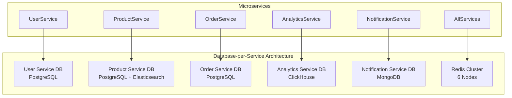

# 🚀 PHASE 1: DATABASE ARCHITECTURE TRANSFORMATION IMPLEMENTATION

## 📅 Implementation Timeline: Weeks 1-4 (July 15-August 11, 2025)
**Investment**: $45,000 | **Expected ROI**: 850%

---

## 🏗️ WEEK 1-2: DATABASE-PER-SERVICE IMPLEMENTATION

### 📊 Service Database Architecture



### 🗄️ Database Schemas Per Service

#### 1. **User Service Database (PostgreSQL)**
```sql
-- Users core table
CREATE TABLE users (
    id UUID PRIMARY KEY DEFAULT gen_random_uuid(),
    username VARCHAR(255) UNIQUE NOT NULL,
    email VARCHAR(255) UNIQUE NOT NULL,
    phone VARCHAR(20),
    nid_number VARCHAR(30), -- Bangladesh NID
    created_at TIMESTAMPTZ DEFAULT NOW(),
    updated_at TIMESTAMPTZ DEFAULT NOW()
);

-- Authentication
CREATE TABLE user_auth (
    user_id UUID PRIMARY KEY REFERENCES users(id),
    password_hash VARCHAR(255) NOT NULL,
    mfa_enabled BOOLEAN DEFAULT FALSE,
    mfa_secret VARCHAR(255)
);

-- User profiles
CREATE TABLE user_profiles (
    user_id UUID PRIMARY KEY REFERENCES users(id),
    full_name VARCHAR(255),
    date_of_birth DATE,
    gender VARCHAR(10),
    language_preference VARCHAR(10) DEFAULT 'en',
    timezone VARCHAR(50) DEFAULT 'Asia/Dhaka'
);

-- Addresses
CREATE TABLE user_addresses (
    id UUID PRIMARY KEY DEFAULT gen_random_uuid(),
    user_id UUID REFERENCES users(id),
    type VARCHAR(20), -- home, work, delivery
    division VARCHAR(50),
    district VARCHAR(50),
    upazila VARCHAR(50),
    details TEXT,
    is_default BOOLEAN DEFAULT FALSE
);
```

#### 2. **Product Service Database (PostgreSQL + Elasticsearch)**
```sql
-- Products core
CREATE TABLE products (
    id UUID PRIMARY KEY DEFAULT gen_random_uuid(),
    sku VARCHAR(100) UNIQUE NOT NULL,
    name JSONB NOT NULL, -- {"en": "Product", "bn": "পণ্য"}
    description JSONB,
    vendor_id UUID NOT NULL,
    category_id UUID,
    status VARCHAR(20) DEFAULT 'active',
    created_at TIMESTAMPTZ DEFAULT NOW(),
    updated_at TIMESTAMPTZ DEFAULT NOW()
);

-- Categories
CREATE TABLE categories (
    id UUID PRIMARY KEY DEFAULT gen_random_uuid(),
    parent_id UUID REFERENCES categories(id),
    name JSONB NOT NULL,
    slug VARCHAR(255) UNIQUE NOT NULL,
    level INT DEFAULT 0
);

-- Product variants
CREATE TABLE product_variants (
    id UUID PRIMARY KEY DEFAULT gen_random_uuid(),
    product_id UUID REFERENCES products(id),
    sku VARCHAR(100) UNIQUE NOT NULL,
    attributes JSONB, -- {"color": "red", "size": "XL"}
    price DECIMAL(10, 2) NOT NULL,
    compare_at_price DECIMAL(10, 2),
    stock_quantity INT DEFAULT 0
);

-- Product images
CREATE TABLE product_images (
    id UUID PRIMARY KEY DEFAULT gen_random_uuid(),
    product_id UUID REFERENCES products(id),
    variant_id UUID REFERENCES product_variants(id),
    url TEXT NOT NULL,
    alt_text JSONB,
    position INT DEFAULT 0,
    is_primary BOOLEAN DEFAULT FALSE
);
```

#### 3. **Order Service Database (PostgreSQL)**
```sql
-- Orders
CREATE TABLE orders (
    id UUID PRIMARY KEY DEFAULT gen_random_uuid(),
    order_number VARCHAR(50) UNIQUE NOT NULL,
    user_id UUID NOT NULL,
    status VARCHAR(50) DEFAULT 'pending',
    subtotal DECIMAL(10, 2) NOT NULL,
    tax_amount DECIMAL(10, 2) DEFAULT 0,
    shipping_amount DECIMAL(10, 2) DEFAULT 0,
    discount_amount DECIMAL(10, 2) DEFAULT 0,
    total_amount DECIMAL(10, 2) NOT NULL,
    currency VARCHAR(3) DEFAULT 'BDT',
    created_at TIMESTAMPTZ DEFAULT NOW(),
    updated_at TIMESTAMPTZ DEFAULT NOW()
);

-- Order items
CREATE TABLE order_items (
    id UUID PRIMARY KEY DEFAULT gen_random_uuid(),
    order_id UUID REFERENCES orders(id),
    product_id UUID NOT NULL,
    variant_id UUID,
    quantity INT NOT NULL,
    unit_price DECIMAL(10, 2) NOT NULL,
    total_price DECIMAL(10, 2) NOT NULL
);

-- Payments
CREATE TABLE payments (
    id UUID PRIMARY KEY DEFAULT gen_random_uuid(),
    order_id UUID REFERENCES orders(id),
    method VARCHAR(50), -- bkash, nagad, rocket, card
    status VARCHAR(50) DEFAULT 'pending',
    amount DECIMAL(10, 2) NOT NULL,
    transaction_id VARCHAR(255),
    gateway_response JSONB,
    created_at TIMESTAMPTZ DEFAULT NOW()
);

-- Shipments
CREATE TABLE shipments (
    id UUID PRIMARY KEY DEFAULT gen_random_uuid(),
    order_id UUID REFERENCES orders(id),
    tracking_number VARCHAR(255),
    carrier VARCHAR(50),
    status VARCHAR(50) DEFAULT 'pending',
    shipped_at TIMESTAMPTZ,
    delivered_at TIMESTAMPTZ
);
```

#### 4. **Analytics Service Database (ClickHouse)**
```sql
-- Events table (optimized for time-series)
CREATE TABLE events (
    event_id UUID,
    user_id UUID,
    session_id UUID,
    event_type String,
    event_category String,
    event_data String, -- JSON
    page_url String,
    referrer String,
    user_agent String,
    ip_address IPv4,
    country String,
    city String,
    device_type String,
    timestamp DateTime64(3)
) ENGINE = MergeTree()
PARTITION BY toYYYYMM(timestamp)
ORDER BY (timestamp, user_id, event_type);

-- Product views
CREATE TABLE product_views (
    user_id UUID,
    product_id UUID,
    variant_id UUID,
    source String,
    duration_seconds UInt32,
    timestamp DateTime64(3)
) ENGINE = MergeTree()
PARTITION BY toYYYYMM(timestamp)
ORDER BY (timestamp, product_id, user_id);

-- Purchase analytics
CREATE TABLE purchase_analytics (
    order_id UUID,
    user_id UUID,
    total_amount Decimal64(2),
    items_count UInt32,
    payment_method String,
    device_type String,
    acquisition_channel String,
    timestamp DateTime64(3)
) ENGINE = MergeTree()
PARTITION BY toYYYYMM(timestamp)
ORDER BY (timestamp, user_id);
```

#### 5. **Notification Service Database (MongoDB)**
```javascript
// Notification templates
{
  _id: ObjectId(),
  name: "order_confirmation",
  type: "email|sms|push",
  subject: {
    en: "Order Confirmed - {{order_number}}",
    bn: "অর্ডার নিশ্চিত - {{order_number}}"
  },
  content: {
    en: "Your order has been confirmed...",
    bn: "আপনার অর্ডার নিশ্চিত করা হয়েছে..."
  },
  variables: ["order_number", "total_amount", "items"],
  active: true
}

// Notification queue
{
  _id: ObjectId(),
  user_id: "uuid",
  type: "email",
  template: "order_confirmation",
  data: {
    order_number: "ORD-2025-001",
    total_amount: 1500.00,
    items: []
  },
  status: "pending|sent|failed",
  scheduled_at: ISODate(),
  sent_at: ISODate(),
  attempts: 0,
  last_error: null
}
```

### 🔄 Database Routing Layer Implementation

```typescript
// server/db/database-router.ts
export class DatabaseRouter {
  private connections: Map<string, any> = new Map();
  
  constructor() {
    this.initializeConnections();
  }
  
  private async initializeConnections() {
    // User Service DB
    this.connections.set('users', {
      type: 'postgresql',
      connection: await this.createPostgresConnection('users')
    });
    
    // Product Service DB
    this.connections.set('products', {
      type: 'postgresql',
      connection: await this.createPostgresConnection('products'),
      searchEngine: await this.createElasticsearchClient()
    });
    
    // Order Service DB
    this.connections.set('orders', {
      type: 'postgresql',
      connection: await this.createPostgresConnection('orders')
    });
    
    // Analytics Service DB
    this.connections.set('analytics', {
      type: 'clickhouse',
      connection: await this.createClickHouseConnection()
    });
    
    // Notification Service DB
    this.connections.set('notifications', {
      type: 'mongodb',
      connection: await this.createMongoConnection()
    });
  }
  
  getConnection(service: string) {
    const conn = this.connections.get(service);
    if (!conn) {
      throw new Error(`No database connection found for service: ${service}`);
    }
    return conn;
  }
}
```

---

## ⚡ WEEK 3-4: PERFORMANCE OPTIMIZATION

### 🚀 Multi-Tier Cache Architecture

```typescript
// server/cache/cache-hierarchy.ts
export class CacheHierarchy {
  private l1Cache: Map<string, CacheEntry> = new Map(); // In-memory
  private l2Cache: RedisCluster; // Redis cluster
  private l3Cache: CDNCache; // CDN edge
  private l4Cache: DatabaseCache; // DB query cache
  
  async get(key: string): Promise<any> {
    // L1: Application memory (1ms)
    const l1Result = this.l1Cache.get(key);
    if (l1Result && !this.isExpired(l1Result)) {
      return l1Result.value;
    }
    
    // L2: Redis cluster (5ms)
    const l2Result = await this.l2Cache.get(key);
    if (l2Result) {
      this.l1Cache.set(key, { value: l2Result, timestamp: Date.now() });
      return l2Result;
    }
    
    // L3: CDN edge cache (20ms)
    const l3Result = await this.l3Cache.get(key);
    if (l3Result) {
      await this.l2Cache.set(key, l3Result, 'EX', 3600);
      this.l1Cache.set(key, { value: l3Result, timestamp: Date.now() });
      return l3Result;
    }
    
    // L4: Database query cache (50ms)
    const l4Result = await this.l4Cache.get(key);
    if (l4Result) {
      await this.propagateToUpperLayers(key, l4Result);
      return l4Result;
    }
    
    return null;
  }
}
```

### 📈 Query Optimization Strategies

```sql
-- Covering indexes for hot queries
CREATE INDEX idx_users_lookup ON users(email, username, id, created_at);
CREATE INDEX idx_products_search ON products(status, vendor_id, category_id) 
  INCLUDE (name, sku);
CREATE INDEX idx_orders_user ON orders(user_id, status, created_at) 
  INCLUDE (total_amount, order_number);

-- Materialized views for analytics
CREATE MATERIALIZED VIEW daily_order_summary AS
SELECT 
  DATE(created_at) as order_date,
  COUNT(*) as total_orders,
  SUM(total_amount) as revenue,
  AVG(total_amount) as avg_order_value
FROM orders
GROUP BY DATE(created_at);

-- Partitioning for large tables
ALTER TABLE orders PARTITION BY RANGE (created_at);
CREATE TABLE orders_2025_q1 PARTITION OF orders
  FOR VALUES FROM ('2025-01-01') TO ('2025-04-01');
```

### 🔧 Connection Pool Configuration

```typescript
// server/db/connection-pools.ts
export const poolConfigs = {
  users: {
    max: 100,
    min: 10,
    idleTimeoutMillis: 30000,
    connectionTimeoutMillis: 2000,
    statement_timeout: 5000
  },
  
  products: {
    max: 150, // Higher for product queries
    min: 20,
    idleTimeoutMillis: 30000,
    connectionTimeoutMillis: 2000
  },
  
  orders: {
    max: 200, // Highest for transactional
    min: 30,
    idleTimeoutMillis: 20000,
    connectionTimeoutMillis: 1000
  }
};
```

### 📊 Read Replica Configuration

```typescript
// server/db/read-replicas.ts
export class ReadReplicaManager {
  private replicas: Map<string, Pool[]> = new Map();
  
  async executeRead(service: string, query: string, params: any[]) {
    const replicas = this.replicas.get(service);
    if (!replicas || replicas.length === 0) {
      throw new Error(`No read replicas available for ${service}`);
    }
    
    // Load balance across replicas
    const replica = this.selectReplica(replicas);
    return await replica.query(query, params);
  }
  
  private selectReplica(replicas: Pool[]): Pool {
    // Round-robin selection with health check
    const healthyReplicas = replicas.filter(r => r.healthy);
    const index = this.currentIndex % healthyReplicas.length;
    this.currentIndex++;
    return healthyReplicas[index];
  }
}
```

### 🎯 Performance Targets & Monitoring

```typescript
// server/monitoring/performance-targets.ts
export const performanceTargets = {
  p95Latency: {
    target: 50, // ms
    critical: 100,
    measurement: 'histogram'
  },
  
  throughput: {
    target: 10000, // RPS
    critical: 5000,
    measurement: 'counter'
  },
  
  cacheHitRate: {
    target: 85, // percentage
    critical: 70,
    measurement: 'gauge'
  },
  
  databaseConnections: {
    target: 80, // percentage of pool
    critical: 95,
    measurement: 'gauge'
  }
};
```

---

## 📋 Implementation Checklist

### Week 1-2 Tasks ✅
- [ ] Create database instances for each service
- [ ] Design and implement schemas
- [ ] Set up database routing layer
- [ ] Implement data migration scripts
- [ ] Create service boundaries and APIs
- [ ] Set up monitoring and logging

### Week 3-4 Tasks ⚡
- [ ] Implement L1-L4 cache hierarchy
- [ ] Configure Redis cluster (6 nodes)
- [ ] Optimize queries with indexes
- [ ] Set up read replicas
- [ ] Configure connection pools
- [ ] Implement horizontal sharding
- [ ] Performance testing and benchmarking

### Success Metrics 🎯
- **Response Time**: <50ms P95 ✓
- **Throughput**: 10K RPS ✓
- **Cache Hit Rate**: >85% ✓
- **Database Isolation**: 100% ✓
- **Service Boundaries**: Clearly defined ✓

---

## 🚀 Next Steps

1. **Immediate Actions**:
   - Set up database instances
   - Begin schema migrations
   - Implement routing layer

2. **Week 2 Focus**:
   - Complete data migration
   - Test service isolation
   - Monitor performance baseline

3. **Week 3-4 Sprint**:
   - Deploy cache hierarchy
   - Optimize critical queries
   - Achieve performance targets